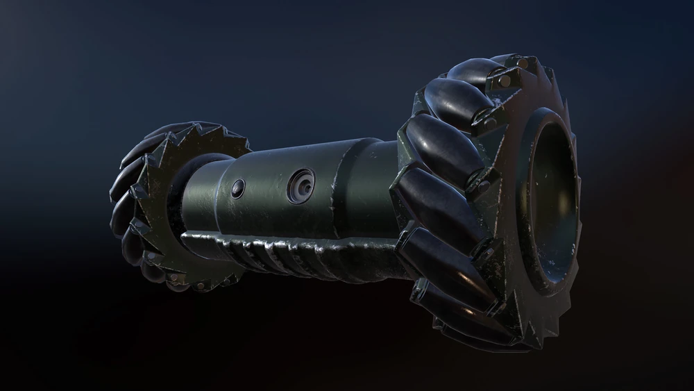

# Rainbow Six Siege Drone

Tehtävänä on rakentaa lähes samankaltainen drone kuin pelissä Rainbow Six Siege kuitenkin poistamalla tarpeettomia tai vaikeasti toteutettavia osia, mutta myös lisäämällä osia, joista voisi olla hyötyä. 

## 3D-mallinnus ja -tulostus
  Runko on mallinnettu onshape-ohjelmalla. 
## Moottorit ja renkaat

  ### Renkaat
  Renkaiden valintaan vaikuttaa sekä dronen liikkuvuuden maksimoiminen että renkaiden tasaisuus, koska tärinä vaikuttaa kameran kuvaan.
  
  #### Vaihtoehto 1: Mecanum Pyörät
  Mecanum pyörät mahdollistavat 4 pyörän konfiguraatiolla liikkumisen mihin tahansa suuntaan vaakatasolla. Koska dronessa on kuitenkin vain kaksi pyörää, ei se kykenisi tällä rengasmallilla (ainakaan omien tietojeni mukaan) kuin rajoitettuun sivuttaiseen liikkeeseen eteen- ja taaksepäin liikkumisen lisäksi. 
  Yksi mahdollisuus olisi sijoittaa kaksi lisäpyörää droneen kuten videolla [Collinear Mecanum Drive Video](https://www.youtube.com/watch?v=EG2pka4Bczg) ([CMD Github](https://github.com/matthew-t-watson/CollinearMecanumDrive)). Ongelmaksi osoittautuisi renkaiden ja lisämoottoreiden sijoitus jo muutenkin pieneen laitteeseen, mutta myös mihin ne olisi parasta sijoittaa. Toinen ongelma olisi juuri tämän rengastyypin epätasaisuus ja miten se vaikuttaisi kameran kuvaan etenkin suuremmilla nopeuksilla.

  #### Vaihtoehto 2: Omnipyörät
  Omnipyörien avulla drone pystyisi liikkumaan mihin suuntaan vain kolmella pyörällä, jotka olisivat 120 asteen kulmassa toisiaan vastaan. Tämän lisäpyörän voisi sijoittaa esimerkiksi taakse jolloin se samalla tasapainottaisi dronea. 

  #### Vaihtoehto 3: Normaalit pyörät
  ... normaalit pyörät

## Kamera

Käytössä Raspberry Pi Camera v2 moduuli. 

Videon webstriimaamiseen käytetään Picamera2 python kirjaston antimia sekä tarkemmin valmiiksi kirjoitettua [python koodia](https://github.com/raspberrypi/picamera2/blob/main/examples/mjpeg_server.py).

## Ohjaus

## Muut osat
